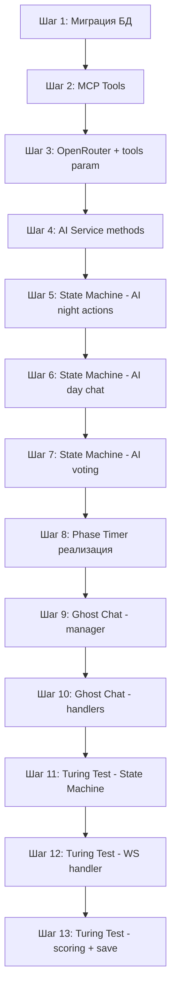

# AI Mafia Backend — Детальный план реализации

## 1. Текущее состояние кода

### Что уже реализовано

| Компонент | Файл | Статус |
|-----------|------|--------|
| StateMachine: фазы LOBBY/ROLE_ASSIGNMENT/NIGHT/DAY/VOTING/FINISHED | `app/game/state_machine.py` | ✅ каркас готов |
| StateMachine: `_broadcast`, `_send_to_player` | `app/game/state_machine.py` | ✅ работает |
| StateMachine: `resolve_night_actions` — логика kill/heal/investigate | `app/game/state_machine.py` | ✅ логика верна |
| StateMachine: `check_game_over` — победа мафии/мирных | `app/game/state_machine.py` | ✅ работает |
| AI Service: профили персонажей (AICharacter) | `app/services/ai_service.py` | ✅ готово |
| AI Service: `generate_response`, `generate_structured_response` | `app/services/ai_service.py` | ✅ работает (без tool-вызовов) |
| OpenRouter Client: `generate_response`, `generate_structured_response` | `app/ai/openrouter_client.py` | ✅ работает (без tools) |
| Game Service: `start_game_for_room`, `_fill_with_ai_players` | `app/services/game_service.py` | ✅ готово |
| Game Service: `submit_night_action`, `submit_vote` | `app/services/game_service.py` | ✅ готово |
| WS Handlers: аутентификация, маршрутизация сообщений | `app/websocket/handlers.py` | ✅ готово |
| WS Handlers: ночной канал мафии, kick, reconnect, ready | `app/websocket/handlers.py` | ✅ готово |
| WS Manager: broadcast_to_room, send_to_player, broadcast_to_players | `app/websocket/manager.py` | ✅ готово |
| Модели БД | `app/models/` | ✅ готово |
| CRUD операции | `app/crud/` | ✅ готово |

### Что является заглушками / TODO

| Компонент | Файл | Проблема |
|-----------|------|---------|
| `handle_night()` — ночные действия | `state_machine.py:248-271` | `random.choice` вместо AI-вызовов |
| `handle_voting()` — голосование | `state_machine.py:410-414` | `random.choice` вместо AI-вызовов |
| `handle_day()` — дневной чат ботов | `state_machine.py:381` | `asyncio.sleep(5)` без реального чата |
| `handle_lobby()` | `state_machine.py:137-145` | `pass` — не делает ничего |
| `_phase_timer()` | `game_service.py:461-474` | `pass` — полная заглушка |
| MCP Tools | — | Файл не существует |
| Tool calling в OpenRouter Client | `openrouter_client.py` | Параметр `tools` не передаётся |
| Ghost Chat (мёртвые игроки) | `handlers.py` | Мёртвые могут писать в общий чат |
| Фаза TURING_TEST | — | Не существует нигде |
| Поле `turing_votes` в БД | `models/game.py` | Колонка отсутствует |
| Поле `humanness_score` в БД | `models/game.py` | Колонка отсутствует |

---

## 2. Архитектурные решения

### 2.1 MCP Tool Calling — схема интеграции

Модель OpenAI/OpenRouter поддерживает параметр `tools` в запросе. Когда пользователь просит модель совершить действие (голосовать/атаковать/написать сообщение), модель возвращает `tool_calls` вместо обычного текста. Наш код перехватывает эти вызовы и направляет их в `game_service.py`.

```
StateMachine.handle_night()
    └─> ai_service.request_night_action(player, game_ctx)
            └─> openrouter_client.generate_response(messages, tools=NIGHT_TOOLS)
            └─> response.choices[0].message.tool_calls?
                    YES ─> MCPToolDispatcher.dispatch(tool_call, player, game_service)
                               └─> game_service.submit_night_action(...)
                    NO  ─> fallback: парсим текст или random
```

```
StateMachine.handle_day() (очередь сообщений)
    └─> ai_service.request_chat_message(player, history)
            └─> openrouter_client.generate_response(messages, tools=DAY_TOOLS)
            └─> tool_call "send_message" ─> MCPToolDispatcher
                    └─> ws_manager.broadcast_to_room(chat_event)
                         + persist GameEvent
```

```
StateMachine.handle_voting()
    └─> ai_service.request_vote(player, alive_players, history)
            └─> openrouter_client.generate_response(messages, tools=VOTE_TOOLS)
            └─> tool_call "vote_for_player" ─> MCPToolDispatcher
                    └─> game_service.submit_vote(...)
```

### 2.2 Phase Timer — архитектура

Каждая фаза записывает время начала в `StateMachine.phase_started_at: float`. `_phase_timer` в `GameService` в цикле:
1. Читает `machine.current_phase` и `machine.phase_started_at`
2. Сравнивает с конфигурационным тайм-аутом
3. Если истёк — вызывает `machine.force_advance_phase()`, который принудительно финализирует текущую фазу (собирает доступные голоса/действия и переходит дальше)

### 2.3 Ghost Chat — архитектура

`ConnectionManager` получает отдельный словарь:
```python
ghost_connections: Dict[int, Set[WebSocket]]  # room_id -> dead/spectator ws
```
Метод `broadcast_to_ghosts(room_id, message)` рассылает только в этот словарь.

В `handlers.py`:
- При регистрации WS: если `player.is_alive == False` — подключаем в `ghost_connections`, а не в `active_connections`
- В `handle_chat_message`: если игрок мёртв — отправляем в `ghost_connections` (видят только мёртвые + зрители)
- При смерти игрока в `resolve_night_actions` / `handle_voting`: перемещаем WS из `active_connections` в `ghost_connections`

### 2.4 Turing Test — архитектура

```
check_game_over() → winner определён
    └─> current_phase = TURING_TEST (новая фаза)
    └─> broadcast "turing_test_started" + список всех player_ids+nicknames (без ролей!)
    └─> Таймер 60 сек ожидает голосов
    └─> handle_turing_vote WS-handler собирает {voter_id: guessed_ai_player_ids[]}
    └─> По истечении: подсчёт humanness_score, сохранение в game.turing_votes, переход в FINISHED
```

---

## 3. Список файлов для создания / изменения

### 3.1 Новые файлы

#### `app/ai/mcp_tools.py` — СОЗДАТЬ

```
Содержит:
- Константы-описания инструментов в формате OpenRouter tools API:
    TOOL_SEND_MESSAGE     — отправка в чат (параметр: content: str)
    TOOL_VOTE_FOR_PLAYER  — дневное голосование (параметр: target_player_id: int)
    TOOL_NIGHT_ACTION     — ночное действие (параметры: action_type: str, target_player_id: int)
    TOOL_GET_GAME_STATE   — получить текущее состояние (без параметров)
- Наборы инструментов:
    DAY_TOOLS   = [TOOL_SEND_MESSAGE, TOOL_GET_GAME_STATE]
    VOTE_TOOLS  = [TOOL_VOTE_FOR_PLAYER, TOOL_GET_GAME_STATE]
    NIGHT_TOOLS = [TOOL_NIGHT_ACTION, TOOL_GET_GAME_STATE]
- Класс MCPToolDispatcher:
    async def dispatch(tool_call, player_id, room_id, game_service, db) -> Any
        — парсит tool_call.function.name, маршрутизирует:
            "send_message"     → game_service.process_ai_chat_message(...)
            "vote_for_player"  → game_service.submit_vote(...)
            "perform_night_action" → game_service.submit_night_action(...)
            "get_game_state"   → game_service.get_game_state(...)
```

**Формат tool definition для OpenRouter:**
```json
{
  "type": "function",
  "function": {
    "name": "send_message",
    "description": "Отправить сообщение в игровой чат",
    "parameters": {
      "type": "object",
      "properties": {
        "content": {"type": "string", "description": "Текст сообщения"}
      },
      "required": ["content"]
    }
  }
}
```

---

### 3.2 Изменяемые файлы

#### `app/ai/openrouter_client.py` — ИЗМЕНИТЬ

**Что изменить:**
- В `generate_response()`: добавить параметр `tools: Optional[List[Dict]] = None`. Если передан — добавлять в payload `"tools": tools, "tool_choice": "auto"`.
- Возвращаемый `response` уже содержит стандартный OpenAI-формат `choices[0].message.tool_calls` — ничего дополнительного не нужно.

```python
# Было:
async def generate_response(self, messages, model=None, temperature=0.7, max_tokens=None, stream=False)

# Станет:
async def generate_response(self, messages, model=None, temperature=0.7, max_tokens=None,
                             stream=False, tools=None)
```

---

#### `app/services/ai_service.py` — ИЗМЕНИТЬ

**Что изменить:**

1. **`generate_response()`**: добавить параметр `tools: Optional[List[Dict]] = None`, передавать его в `self.client.generate_response(...)`.

2. **Новый метод `request_night_action()`**:
   - Принимает: `player: Player`, `alive_players: List[Player]`, `game_context: str`, `character_key: str`
   - Составляет промпт с описанием ночной фазы и доступных целей
   - Вызывает `generate_response(messages, tools=NIGHT_TOOLS)`
   - Возвращает `(tool_calls, raw_response)` — либо спец. структуру для диспетчера, либо fallback-действие

3. **Новый метод `request_day_message()`**:
   - Принимает: `player: Player`, `chat_history: List[Dict]`, `day_number: int`, `character_key: str`
   - Составляет промпт с историей сообщений дня
   - Вызывает `generate_response(messages, tools=DAY_TOOLS, simulate_typing=True)`
   - Возвращает `(tool_calls, raw_response)`

4. **Новый метод `request_vote()`**:
   - Принимает: `player: Player`, `alive_players: List[Player]`, `chat_history: List[Dict]`, `character_key: str`
   - Составляет промпт с просьбой проголосовать
   - Вызывает `generate_response(messages, tools=VOTE_TOOLS)`
   - Возвращает `(tool_calls, raw_response)`

5. **Вспомогательный метод `_build_game_context()`**:
   - Принимает: `game_state_dict: Dict`
   - Форматирует состояние игры в строку для промпта (фаза, день, живые игроки)

---

#### `app/game/state_machine.py` — ИЗМЕНИТЬ

**Что изменить:**

1. **Добавить `TURING_TEST` в `GamePhase`**:
```python
class GamePhase(str, Enum):
    LOBBY = "lobby"
    ROLE_ASSIGNMENT = "role_assignment"
    NIGHT = "night"
    DAY = "day"
    VOTING = "voting"
    TURING_TEST = "turing_test"   # НОВАЯ
    FINISHED = "finished"
```

2. **Добавить поля в `__init__`**:
```python
self.phase_started_at: float = 0.0      # время начала текущей фазы
self.day_chat_history: List[Dict] = []   # история сообщений текущего дня
self.ai_service: Optional[AIService] = None  # инжектировать при создании
self.mcp_dispatcher: Optional[MCPToolDispatcher] = None
self.turing_votes: Dict[int, List[int]] = {}  # voter_id -> [guessed_ai_ids]
```

3. **Добавить `ai_service` и `mcp_dispatcher` в конструктор** (параметры):
```python
def __init__(self, room_id, db, ws_manager=None, ai_service=None, mcp_dispatcher=None)
```

4. **`handle_lobby()`**: удалить `pass`, сделать правильное ожидание сигнала старта:
```python
async def handle_lobby(self):
    # Ждать, пока game_service не вызовет transition_to(ROLE_ASSIGNMENT)
    # Реализовать через asyncio.Event или просто sleep в цикле
    while self.current_phase == GamePhase.LOBBY and self.is_running:
        await asyncio.sleep(0.5)
```

5. **`handle_night()` — заменить `random.choice` на AI-вызовы**:
```python
async def handle_night(self):
    # ... broadcast night_started (уже есть) ...
    self.phase_started_at = asyncio.get_event_loop().time()
    
    for player in alive_players:
        if player.is_ai and player.role in (MAFIA, DOCTOR, COMMISSIONER):
            action = await self._request_ai_night_action(player, alive_players)
            self.night_actions[player.id] = action
        # Если игрок-человек — ждём его действие через submit_night_action (уже работает)
    
    # Ждать пока все активные игроки (или тайм-аут) не совершат действие
    await self._wait_for_night_actions(alive_players)
    await self.resolve_night_actions()
    
async def _request_ai_night_action(self, player, alive_players) -> Dict:
    # Вызов ai_service.request_night_action(...)
    # Диспетчеризация tool_call через mcp_dispatcher
    # Fallback на random если AI не ответил корректно
```

6. **`handle_day()` — реализовать очередь сообщений AI**:
```python
async def handle_day(self):
    # ... broadcast day_started (уже есть) ...
    self.phase_started_at = asyncio.get_event_loop().time()
    self.day_chat_history = []
    
    # Запустить задачи для AI-ботов — они читают историю и постепенно пишут
    ai_players = [p for p in alive_players if p.is_ai]
    tasks = [asyncio.create_task(self._ai_day_chat_turn(p, alive_players)) for p in ai_players]
    
    # Ждать настоящий таймаут дня (управляется _phase_timer в GameService)
    await asyncio.gather(*tasks, return_exceptions=True)
    
    # ... broadcast voting_started, перейти в VOTING ...

async def _ai_day_chat_turn(self, player, alive_players):
    # Имитация паузы (reading time)
    await asyncio.sleep(random.uniform(2, 8))
    
    # Получить сообщение от AI через ai_service.request_day_message(...)
    # При наличии tool_call "send_message" → mcp_dispatcher.dispatch(...)
    #   → game_service.process_ai_chat_message → ws_manager.broadcast_to_room
    #   → добавить в self.day_chat_history
```

7. **`handle_voting()` — заменить `random.choice` на AI-вызовы**:
```python
async def handle_voting(self):
    # ... Reset votes ...
    self.phase_started_at = asyncio.get_event_loop().time()
    
    for player in alive_players:
        if player.is_ai:
            vote = await self._request_ai_vote(player, alive_players)
            if vote:
                self.votes[player.id] = vote
    
    await self._wait_for_votes(alive_players)  # ждать пока люди проголосуют или тайм-аут
    
    # ... подсчёт голосов (уже есть) ...

async def _request_ai_vote(self, player, alive_players) -> Optional[int]:
    # Вызов ai_service.request_vote(...)
    # Диспетчеризация tool_call "vote_for_player"
    # Fallback на random если AI не ответил
```

8. **`check_game_over()` — переход в TURING_TEST вместо FINISHED**:
```python
# После определения winner:
self.current_phase = GamePhase.TURING_TEST   # раньше было FINISHED
await self.update_game_status(GameStatus.TURING_TEST)
await self._start_turing_test(winner, all_players)
```

9. **Новый метод `handle_turing_test()`**:
```python
async def handle_turing_test(self):
    # Этот метод вызывается из run() для фазы TURING_TEST
    # Просто ждёт TURING_TEST_TIMEOUT секунд, затем завершает
    await asyncio.sleep(TURING_TEST_TIMEOUT)
    await self._finish_turing_test()

async def _start_turing_test(self, winner, all_players):
    # Составить список игроков БЕЗ ролей для голосования
    players_for_vote = [{"id": p.id, "nickname": p.nickname} for p in all_players if p.is_alive is not None]
    await self._broadcast({
        "type": "turing_test_started",
        "winner": winner,
        "players": players_for_vote,
        "timeout": TURING_TEST_TIMEOUT,
        "message": "Угадайте, кто из игроков был ИИ!"
    })
    self.phase_started_at = asyncio.get_event_loop().time()

async def _finish_turing_test(self):
    # Подсчёт метрики, сохранение в БД, переход в FINISHED
    scores = self._calculate_humanness_scores()
    await self._save_turing_results(scores)
    await self._broadcast({
        "type": "turing_test_results",
        "results": scores,
    })
    self.current_phase = GamePhase.FINISHED
    await self.update_game_status(GameStatus.FINISHED)
    await self.handle_finished()
```

10. **Обновить `run()` — добавить TURING_TEST**:
```python
elif self.current_phase == GamePhase.TURING_TEST:
    await self.handle_turing_test()
```

11. **Добавить `_wait_for_night_actions()` и `_wait_for_votes()`**:
```python
async def _wait_for_night_actions(self, alive_players, timeout: float = 55.0):
    # Ждёт пока все НУЖНЫЕ игроки (с ролью) совершат действие
    # Или пока не истечёт тайм-аут
    needed_ids = {p.id for p in alive_players if p.role in (MAFIA, DOCTOR, COMMISSIONER) and not p.is_ai}
    deadline = asyncio.get_event_loop().time() + timeout
    while asyncio.get_event_loop().time() < deadline:
        done = all(pid in self.night_actions for pid in needed_ids)
        if done:
            break
        await asyncio.sleep(1)

async def _wait_for_votes(self, alive_players, timeout: float = 85.0):
    # Ждёт пока все живые НЕ-AI игроки проголосуют или тайм-аут
    needed_ids = {p.id for p in alive_players if not p.is_ai}
    deadline = asyncio.get_event_loop().time() + timeout
    while asyncio.get_event_loop().time() < deadline:
        done = all(pid in self.votes for pid in needed_ids)
        if done:
            break
        await asyncio.sleep(1)
```

---

#### `app/services/game_service.py` — ИЗМЕНИТЬ

**Что изменить:**

1. **`_phase_timer()` — полная реализация**:
```python
async def _phase_timer(self, room_id: int, db: AsyncSession):
    PHASE_TIMEOUTS = {
        GamePhase.NIGHT: 60,
        GamePhase.DAY: 120,
        GamePhase.VOTING: 90,
        GamePhase.TURING_TEST: 60,
    }
    last_phase = None
    phase_start_time = asyncio.get_event_loop().time()
    
    while True:
        await asyncio.sleep(2)
        machine = self.active_machines.get(room_id)
        if not machine or not machine.is_running:
            break
        
        phase = machine.current_phase
        
        # Если фаза сменилась — сбрасываем таймер
        if phase != last_phase:
            last_phase = phase
            phase_start_time = asyncio.get_event_loop().time()
            continue
        
        timeout = PHASE_TIMEOUTS.get(phase)
        if timeout is None:
            continue
        
        elapsed = asyncio.get_event_loop().time() - phase_start_time
        if elapsed >= timeout:
            logger.warning(f"Тайм-аут фазы {phase} в комнате {room_id}, принудительный переход")
            await machine.force_advance_phase()
            # После принудительного перехода сбрасываем
            last_phase = None
```

2. **Новый метод `process_ai_chat_message()`**:
```python
async def process_ai_chat_message(
    self,
    room_id: int,
    player_id: int,
    content: str,
    db: AsyncSession,
) -> None:
    # Вызывается MCPToolDispatcher при tool_call "send_message" от AI-игрока
    # 1. Получает player из БД
    # 2. Сохраняет как GameEvent (тип "chat")
    # 3. Рассылает через ws_manager.broadcast_to_room
    # 4. Добавляет в machine.day_chat_history
```

3. **`start_game_for_room()` — передать `ai_service` в `StateMachine`**:
```python
from app.services.ai_service import ai_service
from app.ai.mcp_tools import MCPToolDispatcher

machine = StateMachine(
    room_id=room_id,
    db=db,
    ws_manager=self.ws_manager,
    ai_service=ai_service,
    mcp_dispatcher=MCPToolDispatcher(game_service=self),
)
```

---

#### `app/websocket/handlers.py` — ИЗМЕНИТЬ

**Что изменить:**

1. **`handle_chat_message()` — блокировать мёртвых игроков в обычном чате**:
```python
async def handle_chat_message(...):
    # В начале функции, после получения content:
    if not player.is_alive:
        # Мёртвый игрок — перенаправить в Ghost Chat
        await _handle_ghost_chat_message(websocket, player, content, game, db)
        return
    # ... остальной код без изменений ...
```

2. **Новая вспомогательная функция `_handle_ghost_chat_message()`**:
```python
async def _handle_ghost_chat_message(websocket, player, content, game, db):
    ghost_payload = {
        "type": "ghost_chat_event",
        "player_id": player.id,
        "nickname": player.nickname,
        "content": content,
        "is_ghost": True,
    }
    if game:
        db.add(GameEvent(
            game_id=game.id,
            player_id=player.id,
            event_type="chat_ghost",
            event_data=json.dumps({"content": content, "nickname": player.nickname}),
        ))
        await db.commit()
    # Рассылка только мёртвым + зрителям
    await manager.broadcast_to_ghosts(player.room_id, ghost_payload)
```

3. **Добавить обработчик `turing_test_vote` в маршрутизатор**:
```python
elif event_type == "turing_test_vote":
    await handle_turing_test_vote(websocket, player, message, db)
```

4. **Новая функция `handle_turing_test_vote()`**:
```python
async def handle_turing_test_vote(websocket, player, message, db):
    """
    Принять голос в Тесте Тьюринга.
    Payload: {"type": "turing_test_vote", "guessed_ai_ids": [1, 5, 7]}
    """
    machine = game_service.active_machines.get(player.room_id)
    if not machine or machine.current_phase != GamePhase.TURING_TEST:
        await manager.send_personal_message({"error": "Тест Тьюринга не активен"}, websocket)
        return
    
    guessed_ai_ids = message.get("guessed_ai_ids", [])
    if not isinstance(guessed_ai_ids, list):
        await manager.send_personal_message({"error": "guessed_ai_ids должен быть списком"}, websocket)
        return
    
    machine.turing_votes[player.id] = guessed_ai_ids
    await manager.send_personal_message(
        {"type": "turing_vote_accepted", "player_id": player.id},
        websocket,
    )
```

---

#### `app/websocket/manager.py` — ИЗМЕНИТЬ

**Что изменить:**

1. **Добавить словарь `ghost_connections`** в `__init__`:
```python
self.ghost_connections: Dict[int, Set[WebSocket]] = {}  # room_id -> ws мёртвых/зрителей
```

2. **Новый метод `connect_ghost()`**:
```python
async def connect_ghost(self, websocket: WebSocket, room_id: int, player_id: int):
    await websocket.accept()
    if room_id not in self.ghost_connections:
        self.ghost_connections[room_id] = set()
    self.ghost_connections[room_id].add(websocket)
    self.websocket_player[websocket] = player_id
    self.websocket_room[websocket] = room_id
```

3. **Новый метод `broadcast_to_ghosts()`**:
```python
async def broadcast_to_ghosts(self, room_id: int, message: dict) -> None:
    connections = self.ghost_connections.get(room_id, set())
    disconnected = set()
    for ws in connections:
        try:
            await ws.send_text(json.dumps(message))
        except Exception:
            disconnected.add(ws)
    for ws in disconnected:
        self.disconnect(ws)
```

4. **Новый метод `move_to_ghost()`** — вызывается при смерти игрока во время игры:
```python
def move_to_ghost(self, player_id: int, room_id: int) -> None:
    # Найти WS этого игрока в active_connections и переместить в ghost_connections
    for ws, pid in list(self.websocket_player.items()):
        if pid == player_id:
            if room_id in self.active_connections:
                self.active_connections[room_id].discard(ws)
            if room_id not in self.ghost_connections:
                self.ghost_connections[room_id] = set()
            self.ghost_connections[room_id].add(ws)
            break
```

5. **`disconnect()` — очищать и `ghost_connections`**:
```python
def disconnect(self, websocket: WebSocket):
    # ... existing code ...
    if room_id and room_id in self.ghost_connections:
        self.ghost_connections[room_id].discard(websocket)
        if not self.ghost_connections[room_id]:
            del self.ghost_connections[room_id]
```

---

#### `app/models/game.py` — ИЗМЕНИТЬ

**Что изменить:**

1. **Добавить `TURING_TEST` в `GameStatus`**:
```python
class GameStatus(str, enum.Enum):
    LOBBY = "lobby"
    NIGHT = "night"
    DAY = "day"
    VOTING = "voting"
    TURING_TEST = "turing_test"   # НОВАЯ
    FINISHED = "finished"
```

2. **Добавить колонки в модель `Game`**:
```python
turing_votes = Column(Text, nullable=True)      # JSON: {voter_id: [guessed_ai_ids]}
humanness_score = Column(Text, nullable=True)   # JSON: {player_id: score_float}
```

---

#### `app/schemas/game.py` — ИЗМЕНИТЬ

**Что изменить:**

1. **Добавить поля в `GameBase` и `GameUpdate`**:
```python
class GameBase(BaseModel):
    # ... existing fields ...
    turing_votes: Optional[Dict[str, Any]] = None
    humanness_score: Optional[Dict[str, Any]] = None

class GameUpdate(BaseModel):
    # ... existing fields ...
    turing_votes: Optional[Dict[str, Any]] = None
    humanness_score: Optional[Dict[str, Any]] = None
```

2. **Добавить валидаторы для новых JSON-полей** по аналогии с `parse_night_actions`.

---

#### `app/crud/game.py` — ИЗМЕНИТЬ

**Что изменить:**

1. **В `create()` и `update()`**: добавить сериализацию/десериализацию для `turing_votes` и `humanness_score` по аналогии с `night_actions` и `voting_results`.

---

## 4. Схемы данных

### 4.1 Новые/изменённые колонки БД

| Таблица | Колонка | Тип | Описание |
|---------|---------|-----|---------|
| `games` | `turing_votes` | `Text (JSON)` | `{voter_id: [guessed_ai_player_id, ...]}` |
| `games` | `humanness_score` | `Text (JSON)` | `{player_id: 0.0..1.0}` — доля голосов, принявших бота за человека |

### 4.2 Новые типы событий GameEvent

| `event_type` | Описание |
|-------------|---------|
| `"chat"` | Обычное сообщение дня (уже есть) |
| `"chat_mafia"` | Ночной чат мафии (уже есть) |
| `"chat_ghost"` | Сообщение мёртвого игрока (Ghost Chat) |
| `"turing_vote"` | Голос в Тесте Тьюринга |
| `"night_action_ai"` | Ночное действие AI-агента через MCP |
| `"vote_ai"` | Голос AI-агента через MCP |

### 4.3 Алгоритм расчёта `humanness_score`

```
Для каждого AI-игрока p:
    total_voters = число живых игроков-людей, проголосовавших в Тесте Тьюринга
    guessed_as_ai = число голосов, правильно назвавших p ИИ
    humanness_score[p.id] = 1.0 - (guessed_as_ai / total_voters)
    # 1.0 = никто не угадал → ИИ выглядел как человек
    # 0.0 = все угадали → ИИ был очевиден
```

---

## 5. WebSocket события

### Новые события от сервера к клиенту

| Тип события | Получатель | Payload |
|-------------|-----------|---------|
| `turing_test_started` | Все (broadcast) | `{winner, players:[{id, nickname}], timeout, message}` |
| `turing_test_results` | Все (broadcast) | `{results: [{player_id, nickname, was_ai, humanness_score}]}` |
| `ghost_chat_event` | Мёртвые + зрители | `{player_id, nickname, content, is_ghost: true}` |
| `player_died` | Все (broadcast) | `{player_id, nickname, cause: "mafia"|"vote"}` |
| `phase_timeout` | Все (broadcast) | `{phase, message}` — уведомление о принудительном переходе |
| `ai_typing` | Все (broadcast) | `{player_id, status: "typing"|"finished"}` |

**Обновлённые существующие события:**

| Тип события | Изменение |
|-------------|----------|
| `game_over` | Теперь НЕ является финальным — после него следует `turing_test_started` |

### Новые события от клиента к серверу

| Тип события | Payload | Описание |
|-------------|---------|---------|
| `turing_test_vote` | `{guessed_ai_ids: [int, ...]}` | Голос в Тесте Тьюринга |

---

## 6. Порядок реализации (с учётом зависимостей)



### Детализация шагов

#### Шаг 1: Миграция БД
**Файлы:** `app/models/game.py`, `app/schemas/game.py`, `app/crud/game.py`
- Добавить `TURING_TEST` в `GameStatus` enum
- Добавить колонки `turing_votes` и `humanness_score` в модель `Game`
- Обновить Pydantic схемы с валидаторами
- Обновить CRUD методы
- Создать Alembic-миграцию (или обновить `scripts/init_db.py`)

**Зависимости:** нет

---

#### Шаг 2: Создание `app/ai/mcp_tools.py`
**Файлы:** `app/ai/mcp_tools.py` (new)
- Определить константы `TOOL_SEND_MESSAGE`, `TOOL_VOTE_FOR_PLAYER`, `TOOL_NIGHT_ACTION`, `TOOL_GET_GAME_STATE`
- Определить наборы `DAY_TOOLS`, `VOTE_TOOLS`, `NIGHT_TOOLS`
- Создать класс `MCPToolDispatcher` с методом `async def dispatch(...)`
  - Принимает: `tool_call: dict`, `player_id: int`, `room_id: int`, `game_service`, `db`
  - Маршрутизирует по `tool_call["function"]["name"]`
  - Возвращает результат выполнения или `None`

**Зависимости:** нет (только импорт `game_service` будет позже, в конструкторе)

---

#### Шаг 3: Обновление `OpenRouterClient`
**Файлы:** `app/ai/openrouter_client.py`
- Добавить параметр `tools: Optional[List[Dict]] = None` в `generate_response()`
- Если `tools` не `None`: добавить `"tools": tools, "tool_choice": "auto"` в payload
- Никаких изменений в возвращаемом типе не нужно (ответ уже содержит `tool_calls`)

**Зависимости:** нет

---

#### Шаг 4: Обновление `AIService`
**Файлы:** `app/services/ai_service.py`
- Добавить параметр `tools` в `generate_response()`
- Реализовать `request_night_action()`, `request_day_message()`, `request_vote()`
- Реализовать `_build_game_context()`
- Логика выбора `character_key` на основе `player.role`

**Зависимости:** Шаги 2, 3

---

#### Шаг 5: State Machine — ночные AI-действия
**Файлы:** `app/game/state_machine.py`
- Добавить `ai_service` и `mcp_dispatcher` в конструктор
- Добавить `phase_started_at` в `__init__`
- Реализовать `_request_ai_night_action()`
- Реализовать `_wait_for_night_actions()`
- Заменить `random.choice` в `handle_night()` на вызовы `_request_ai_night_action()`

**Зависимости:** Шаг 4

---

#### Шаг 6: State Machine — дневной чат AI
**Файлы:** `app/game/state_machine.py`, `app/services/game_service.py`
- Добавить `day_chat_history` в `__init__`
- Реализовать `_ai_day_chat_turn()`
- Обновить `handle_day()` для запуска задач AI-игроков
- Добавить `process_ai_chat_message()` в `GameService`

**Зависимости:** Шаг 5

---

#### Шаг 7: State Machine — голосование AI
**Файлы:** `app/game/state_machine.py`
- Реализовать `_request_ai_vote()`
- Реализовать `_wait_for_votes()`
- Заменить `random.choice` в `handle_voting()` на вызовы AI

**Зависимости:** Шаг 5

---

#### Шаг 8: Phase Timer
**Файлы:** `app/services/game_service.py`
- Полная реализация `_phase_timer()` с отслеживанием `last_phase` и `phase_start_time`
- Добавить `force_advance_phase()` в `StateMachine`:
  - В зависимости от текущей фазы: завершить ночь с имеющимися действиями / завершить день / принять текущие голоса
- Broadcast события `phase_timeout` при принудительном переходе

**Зависимости:** Шаги 5, 6, 7

---

#### Шаг 9: Ghost Chat — ConnectionManager
**Файлы:** `app/websocket/manager.py`
- Добавить `ghost_connections`
- Реализовать `connect_ghost()`, `broadcast_to_ghosts()`, `move_to_ghost()`
- Обновить `disconnect()` для очистки `ghost_connections`

**Зависимости:** нет

---

#### Шаг 10: Ghost Chat — Handlers
**Файлы:** `app/websocket/handlers.py`
- В начале `handle_chat_message()`: проверить `player.is_alive`, перенаправить мёртвых
- Реализовать `_handle_ghost_chat_message()`
- В `handle_reconnect()`: если игрок мёртв — подключать в `ghost_connections`
- В `resolve_night_actions()` (state_machine): вызывать `ws_manager.move_to_ghost()` при убийстве
- В `handle_voting()` (state_machine): вызывать `ws_manager.move_to_ghost()` при голосовании

**Зависимости:** Шаг 9

---

#### Шаг 11: Turing Test — State Machine
**Файлы:** `app/game/state_machine.py`
- Добавить `TURING_TEST` в `GamePhase`
- Добавить `turing_votes: Dict[int, List[int]] = {}` в `__init__`
- Реализовать `_start_turing_test()`, `handle_turing_test()`, `_finish_turing_test()`
- Реализовать `_calculate_humanness_scores()` — алгоритм расчёта метрики
- Реализовать `_save_turing_results()` — сохранение в `game.turing_votes` и `game.humanness_score`
- Изменить `check_game_over()`: переход в `TURING_TEST` вместо `FINISHED`
- Добавить `TURING_TEST` в `run()` loop

**Зависимости:** Шаг 1

---

#### Шаг 12: Turing Test — WS Handler
**Файлы:** `app/websocket/handlers.py`
- Добавить `turing_test_vote` в маршрутизатор `handle_websocket_message()`
- Реализовать `handle_turing_test_vote()`

**Зависимости:** Шаги 1, 11

---

#### Шаг 13: Финальная проверка + handle_lobby fix
**Файлы:** `app/game/state_machine.py`
- Исправить `handle_lobby()`: убрать `pass`, добавить корректный цикл ожидания
- Проверить, что `game_service.start_game_for_room()` правильно передаёт `ai_service` и `mcp_dispatcher` в `StateMachine`
- Убедиться, что GameService передаёт себя в `MCPToolDispatcher` при создании

**Зависимости:** все предыдущие шаги

---

## 7. Критические точки и риски

| Риск | Описание | Решение |
|------|---------|---------|
| Circular imports | `mcp_tools.py` → `game_service.py` → `mcp_tools.py` | Передавать `game_service` в конструктор `MCPToolDispatcher`, не как глобальный импорт |
| DB session в State Machine | `StateMachine` создаётся с одной сессией, но AI-вызовы могут занять >30с | Рассмотреть передачу `db_factory` (callable) вместо `db` сессии, или использовать короткие транзакции |
| Race condition в night actions | AI и человек могут одновременно записать действие | `night_actions` — dict, атомарная запись по ключу; безопасно |
| Модель не поддерживает tool_calls | Некоторые модели OpenRouter не поддерживают tools | Fallback в `request_night_action()`: если `tool_calls` пуст — парсить JSON из обычного текста |
| Alembic миграция GameStatus enum | PostgreSQL enum нельзя легко изменить через Alembic | Использовать `ALTER TYPE ... ADD VALUE` вместо DROP/CREATE |

---

## 8. Конфигурационные параметры (добавить в `core/config.py`)

```python
# --- Game Phase Timeouts ---
PHASE_TIMEOUT_NIGHT: int = Field(default=60, description="Тайм-аут ночной фазы (сек)")
PHASE_TIMEOUT_DAY: int = Field(default=120, description="Тайм-аут дневного обсуждения (сек)")
PHASE_TIMEOUT_VOTING: int = Field(default=90, description="Тайм-аут голосования (сек)")
PHASE_TIMEOUT_TURING: int = Field(default=60, description="Тайм-аут Теста Тьюринга (сек)")

# --- AI Day Chat ---
AI_DAY_MSG_MIN_DELAY: float = Field(default=2.0, description="Мин. задержка перед сообщением бота (сек)")
AI_DAY_MSG_MAX_DELAY: float = Field(default=8.0, description="Макс. задержка перед сообщением бота (сек)")
AI_DAY_MSGS_PER_BOT: int = Field(default=2, description="Макс. сообщений от одного бота в день")
```
