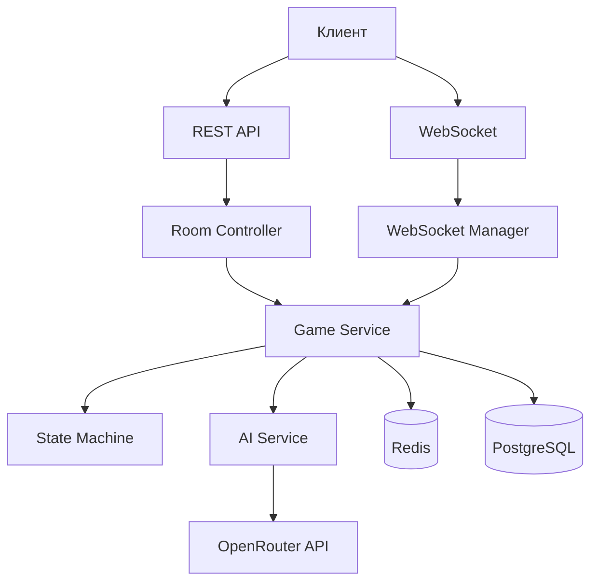

# План проекта AI Mafia

## Обзор
Backend-проект для игры "Мафия" с AI-агентами на базе FastAPI, WebSocket, PostgreSQL, Redis и OpenRouter API.

## Архитектура
Монолитное приложение с модульной структурой.

### Компоненты
1. **API Gateway** (FastAPI) - REST эндпоинты для управления комнатами и WebSocket для игрового процесса.
2. **Game State Machine** - управление фазами игры (Лобби, Распределение ролей, Ночь, День, Голосование).
3. **AI Agent Service** - взаимодействие с OpenRouter API для генерации ответов агентов.
4. **Database Layer** (PostgreSQL) - хранение комнат, игроков, игр.
5. **Cache Layer** (Redis) - хранение состояния комнат, истории чатов, таймеров.
6. **WebSocket Manager** - управление подключениями, рассылка событий.
7. **Session Manager** - JWT/сессии для реконнекта.

### Диаграмма архитектуры


## Структура директорий
```
.
├── app/
│   ├── __init__.py
│   ├── main.py
│   ├── core/
│   │   ├── __init__.py
│   │   ├── config.py
│   │   ├── security.py
│   │   └── dependencies.py
│   ├── models/
│   │   ├── __init__.py
│   │   ├── base.py
│   │   ├── room.py
│   │   ├── player.py
│   │   └── game.py
│   ├── schemas/
│   │   ├── __init__.py
│   │   ├── room.py
│   │   ├── player.py
│   │   └── game.py
│   ├── api/
│   │   ├── __init__.py
│   │   ├── rooms.py
│   │   └── health.py
│   ├── websocket/
│   │   ├── __init__.py
│   │   ├── manager.py
│   │   └── handlers.py
│   ├── services/
│   │   ├── __init__.py
│   │   ├── game_service.py
│   │   ├── room_service.py
│   │   └── ai_service.py
│   ├── game/
│   │   ├── __init__.py
│   │   ├── state_machine.py
│   │   ├── phases.py
│   │   └── roles.py
│   ├── ai/
│   │   ├── __init__.py
│   │   ├── openrouter_client.py
│   │   ├── agent.py
│   │   └── characters.py
│   ├── db/
│   │   ├── __init__.py
│   │   ├── session.py
│   │   └── init_db.py
│   ├── redis/
│   │   ├── __init__.py
│   │   └── client.py
│   └── utils/
│       ├── __init__.py
│       ├── timers.py
│       └── helpers.py
├── tests/
│   ├── __init__.py
│   ├── test_api.py
│   └── test_websocket.py
├── scripts/
│   └── init_db.py
├── docker/
│   ├── Dockerfile
│   └── entrypoint.sh
├── docker-compose.yml
├── .env.example
├── .env
├── requirements.txt
├── pyproject.toml
├── README.md
└── plans/
    └── plan.md
```

## Технологический стек
- Python 3.11+
- FastAPI + Uvicorn
- SQLAlchemy (async)
- PostgreSQL 15
- Redis 7
- Docker + Docker Compose
- Pydantic + pydantic-settings
- WebSockets (websockets library)
- httpx (асинхронные HTTP-запросы)
- OpenRouter API

## Жизненный цикл игры
1. **Лобби**: создание комнаты, подключение игроков, старт игры.
2. **Распределение ролей**: случайное назначение ролей (Мирные, Мафия, Доктор, Комиссар).
3. **Ночь**: мафия выбирает жертву, доктор лечит, комиссар проверяет.
4. **День**: обсуждение, голосование.
5. **Голосование**: подсчёт голосов, исключение игрока.
6. **Повтор** ночи/дня до окончания игры.
7. **Итоги**: раскрытие ролей, статистика.

## Эндпоинты REST API
- `POST /api/rooms` - создать комнату
- `GET /api/rooms/{room_id}` - статус комнаты
- `POST /api/rooms/{room_id}/join` - присоединиться
- `GET /api/rooms/{room_id}/players` - список игроков

## WebSocket события
- `chat_message` - сообщение в чат
- `vote_action` - голосование
- `start_game` - старт игры
- `game_state_update` - обновление фазы
- `chat_event` - новое сообщение
- `timer_update` - обновление таймера
- `personal_info` - приватная информация
- `reveal_endgame` - итоги игры

## Интеграция с OpenRouter
- Асинхронные запросы к `https://openrouter.ai/api/v1/chat/completions`
- Системные промпты с ролью, характером, историей чата
- Стриминг ответов для имитации набора текста
- Тайпинг-индикатор `agent_is_typing`

## База данных
### Таблицы
- `rooms` - информация о комнатах
- `players` - игроки (человек/AI)
- `games` - игровые сессии
- `game_events` - события игры

### Инициализация
Скрипт `scripts/init_db.py` создаёт таблицы и заполняет базовые данные.

## Redis
- Ключи: `room:{room_id}:state`, `room:{room_id}:chat`, `room:{room_id}:timer`
- TTL для автоматической очистки

## Docker Compose
Сервисы:
- `postgres` (порт 5432)
- `redis` (порт 6379)
- `backend` (порт 8000)

## Дальнейшие шаги
1. Создать структуру директорий и файлов.
2. Настроить конфигурацию и зависимости.
3. Реализовать модели и схему данных.
4. Реализовать REST API.
5. Реализовать WebSocket менеджер.
6. Реализовать State Machine.
7. Интегрировать OpenRouter.
8. Написать тесты.
9. Задокументировать.
10. Запустить и протестировать.